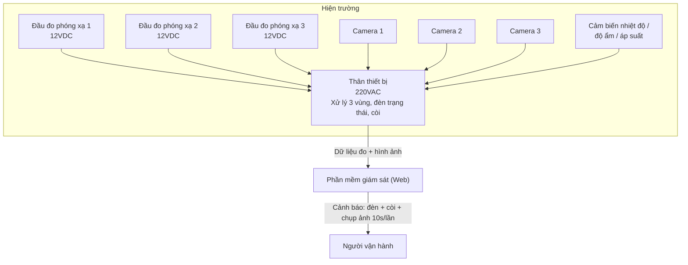

# HTG Monitoring System — Hệ thống giám sát phóng xạ

Hệ thống giám sát bức xạ gamma theo thời gian thực, gồm 3 đầu đo phóng xạ, 3 camera giám sát, cảm biến môi trường (nhiệt độ, độ ẩm, áp suất), thân thiết bị xử lý trung tâm, và phần mềm giám sát trên máy tính (web-based).

## Mục lục

- [Tổng quan](#tổng-quan)
- [Kiến trúc hệ thống](#kiến-trúc-hệ-thống)
- [Cấu trúc thư mục](#cấu-trúc-thư-mục)
- [Phần mềm giám sát (Web)](#phần-mềm-giám-sát-web)
- [Chạy thử](#chạy-thử)
- [Tài liệu thiết kế chi tiết](#tài-liệu-thiết-kế-chi-tiết)
- [Lộ trình phát triển](#lộ-trình-phát-triển)

## Tổng quan

| Thành phần | Mô tả |
|---|---|
| Nguồn điện | Điện lưới 220VAC |
| Đầu đo phóng xạ | 03 đầu đo, ghi nhận bức xạ gamma, nguồn vào 12VDC, truyền dữ liệu về thân thiết bị |
| Camera | 03 camera (1 camera / 1 đầu đo), đồng bộ dữ liệu về thân thiết bị |
| Cảm biến môi trường | 01 cảm biến nhiệt độ, độ ẩm, áp suất |
| Thân thiết bị | Thu nhận dữ liệu từ 3 đầu đo, 3 camera và cảm biến môi trường; hiển thị theo 3 vùng (Vị trí 1/2/3) với đèn trạng thái (xanh/vàng/đỏ) và còi cảnh báo |
| Phần mềm giám sát | Ứng dụng web hiển thị dữ liệu 3 vùng theo thời gian thực, kèm hình ảnh camera, cảnh báo âm thanh/hình ảnh, lưu trữ lịch sử |

Chi tiết đầy đủ xem tại [`docs/mo-ta-thiet-ke.md`](docs/mo-ta-thiet-ke.md).

## Kiến trúc hệ thống



Xem giải thích chi tiết tại [`docs/architecture.md`](docs/architecture.md).

## Cấu trúc thư mục

```
htg-monitoring/
├── README.md
├── LICENSE
├── docs/
│   ├── mo-ta-thiet-ke.md      # Tài liệu thiết kế gốc (đầy đủ)
│   ├── architecture.md         # Kiến trúc & luồng dữ liệu
│   └── superpowers/specs/      # Spec các đợt phát triển
└── src/                         # Phần mềm giám sát (web app)
    ├── index.html
    ├── css/style.css
    └── js/
        ├── app.js               # Điều phối: hiển thị, cảnh báo, lưu trữ bằng chứng
        ├── mock-data.js         # Mô phỏng suất liều 3 đầu đo   (thay bằng API/WebSocket thật)
        ├── mock-data.test.js    # Kiểm chứng bộ mô phỏng không trôi nền
        ├── camera.js            # Nguồn hình ảnh camera          (thay bằng RTSP/MJPEG thật)
        └── alarm.js             # Còi cảnh báo (Web Audio API)
```

## Phần mềm giám sát (Web)

Giao diện web chia thành **3 vùng** tương ứng 3 đầu đo (Vị trí 1, 2, 3). Mỗi vùng hiển thị:

- Giá trị đo suất liều gamma theo thời gian thực
- Hình ảnh camera của vị trí đó, kèm chỉ báo **● REC** khi đang ghi bằng chứng
- Đèn trạng thái: **xanh** (bình thường) / **vàng** (cảnh báo mức 1) / **đỏ** (cảnh báo mức 2)
- Còi cảnh báo: bíp ngắt quãng khi vàng, hú liên tục khi đỏ
- Khi có cảnh báo: tự động chụp và lưu ảnh camera theo chu kỳ **10 giây/ảnh**, kèm giá trị đo **tại từng thời điểm chụp**

Ảnh đã lưu hiện trong khu **Lịch sử ảnh cảnh báo** ở cuối trang — mỗi ảnh gắn suất liều và mốc thời gian, bấm vào để phóng to. Demo giữ 60 ảnh gần nhất trong bộ nhớ trình duyệt.

Hiện tại **dữ liệu đo và hình ảnh camera đều là mô phỏng** (`mock-data.js`, `camera.js`), nhưng ảnh chụp là ảnh JPEG thật nên toàn bộ luồng cảnh báo → chụp → lưu trữ chạy end-to-end đúng như khi có phần cứng. Khi tích hợp thiết bị thật, thay hai module đó là xong; `app.js` không cần sửa (xem [Lộ trình phát triển](#lộ-trình-phát-triển)).

## Chạy thử

Không cần cài đặt gì thêm:

```bash
cd src
python3 -m http.server 8080
# Truy cập http://localhost:8080
```

Mở bằng `file://` cũng chạy, nhưng nên dùng local server để tránh lỗi CORS khi sau này gọi API thật.

Ba điều cần biết khi demo:

1. **Bấm nút `🔇 Bấm để bật tiếng` ở góc trên bên phải trước.** Trình duyệt chặn phát âm thanh cho tới khi trang nhận được thao tác thật của người dùng — không bấm thì còi sẽ câm. Bấm lại để tắt tiếng khi cần thuyết trình.
2. **Dùng thanh `Điều khiển demo`** để ép một vùng sang vàng hoặc đỏ ngay lập tức, thay vì ngồi chờ cảnh báo ngẫu nhiên. Một sự cố đỏ giữ đèn đỏ ~10 giây rồi tắt dần qua vàng về xanh trong khoảng 25 giây — đủ để người xem thấy đèn, nghe còi và thấy ảnh được chụp.
3. Nút `Về bình thường` đưa cả 3 vùng về xanh ngay.

Kiểm chứng bộ mô phỏng (không cần trình duyệt):

```bash
node src/js/mock-data.test.js
```

## Tài liệu thiết kế chi tiết

Bản mô tả thiết kế đầy đủ (nguồn gốc từ tài liệu thiết kế HTG) nằm tại [`docs/mo-ta-thiet-ke.md`](docs/mo-ta-thiet-ke.md).

## Lộ trình phát triển

Bước chặn đầu tiên **không phải viết code mà là chốt giao thức** giữa thân thiết bị và phần mềm: REST hay WebSocket, schema JSON ra sao, luồng camera qua RTSP/MJPEG/WebRTC. Chốt xong thì firmware và phần mềm mới làm song song được.

- [ ] Chốt giao thức thân thiết bị ↔ phần mềm (dữ liệu đo + luồng hình ảnh)
- [ ] Thay `mock-data.js` bằng nguồn dữ liệu thật (REST polling hoặc WebSocket — khuyến nghị WebSocket)
- [ ] Thay `camera.js` bằng luồng hình ảnh thật từ 3 camera
- [ ] Lưu trữ dữ liệu lịch sử vào cơ sở dữ liệu (thay vì bộ nhớ trình duyệt)
- [ ] Xác thực đăng nhập cho người vận hành
- [ ] Xuất báo cáo (PDF/Excel) theo khoảng thời gian
- [ ] Cấu hình ngưỡng cảnh báo (vàng/đỏ) theo từng đầu đo

## Giấy phép

Xem [LICENSE](LICENSE).
