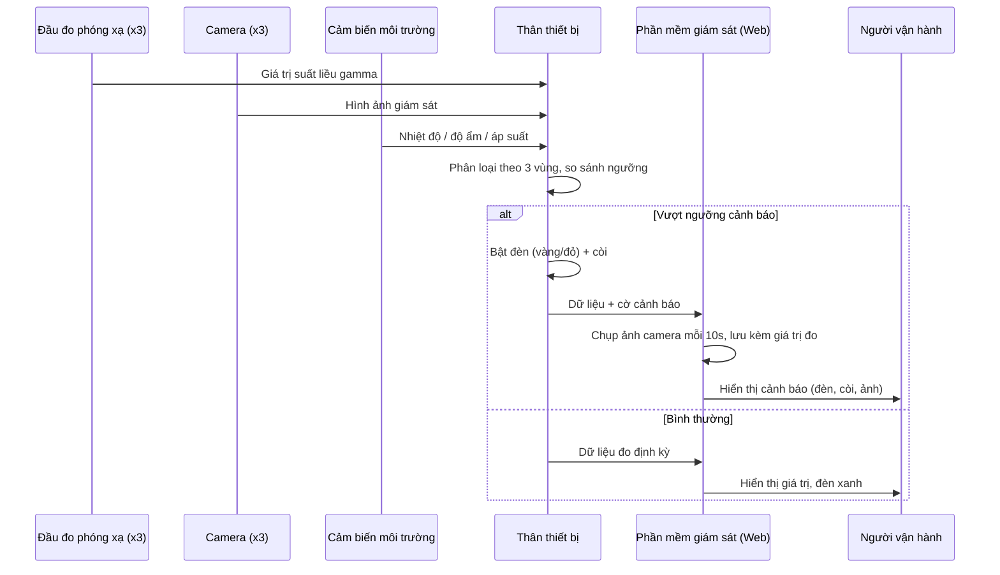

# Kiến trúc hệ thống

## Luồng dữ liệu tổng quát

## Phân vùng giám sát

Cả **thân thiết bị** và **phần mềm giám sát** đều tổ chức dữ liệu theo cùng một mô hình: **3 vùng độc lập**, mỗi vùng gắn với 1 đầu đo + 1 camera.

| Vùng | Đầu đo | Camera | Ngưỡng cảnh báo |
|---|---|---|---|
| Vị trí 1 | Đầu đo 1 | Camera 1 | Cấu hình theo đơn vị đo (µSv/h) |
| Vị trí 2 | Đầu đo 2 | Camera 2 | Cấu hình theo đơn vị đo (µSv/h) |
| Vị trí 3 | Đầu đo 3 | Camera 3 | Cấu hình theo đơn vị đo (µSv/h) |

Mức cảnh báo:

- 🟢 **Xanh** — bình thường, dưới ngưỡng cảnh báo.
- 🟡 **Vàng** — cảnh báo mức 1, vượt ngưỡng thấp.
- 🔴 **Đỏ** — cảnh báo mức 2, vượt ngưỡng cao, kèm còi.

## Thành phần phần mềm (`src/`)

| File | Vai trò |
|---|---|
| `index.html` | Bố cục 3 vùng, khung hiển thị camera, đèn trạng thái, log cảnh báo |
| `css/style.css` | Giao diện, màu sắc đèn trạng thái, responsive layout |
| `js/mock-data.js` | Sinh dữ liệu mô phỏng cho 3 đầu đo (thay bằng kết nối phần cứng thật) |
| `js/app.js` | Vòng lặp cập nhật dữ liệu, đánh giá ngưỡng, điều khiển đèn/còi, chụp & lưu ảnh khi cảnh báo |

## Tích hợp phần cứng thật (bước tiếp theo)

Khi thân thiết bị thật sẵn sàng, thay `mock-data.js` bằng một module gọi:

- **REST API** (polling định kỳ), hoặc
- **WebSocket** (đẩy dữ liệu thời gian thực) — khuyến nghị cho ứng dụng cảnh báo.

Giao diện (`app.js`) đã tách riêng phần **nguồn dữ liệu** khỏi phần **hiển thị/cảnh báo**, nên chỉ cần thay nguồn dữ liệu mà không phải viết lại UI.
