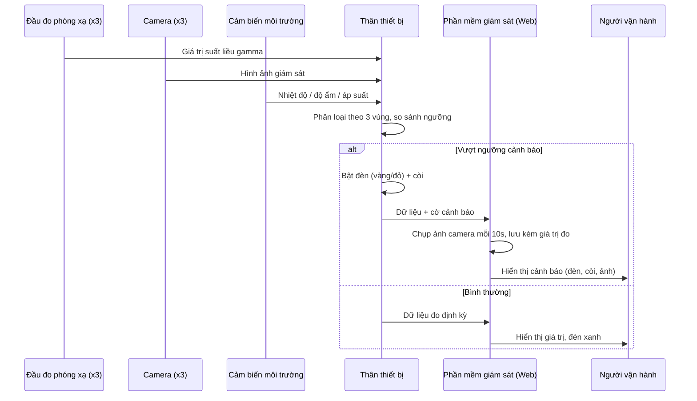

# Kiến trúc hệ thống

## Luồng dữ liệu tổng quát

## Phân vùng giám sát

Cả **thân thiết bị** và **phần mềm giám sát** đều tổ chức dữ liệu theo cùng một mô hình: **3 vùng độc lập**, mỗi vùng gắn với 1 đầu đo + 1 camera.

| Vùng | Đầu đo | Camera | Ngưỡng cảnh báo |
|---|---|---|---|
| Vị trí 1 | Đầu đo 1 | Camera 1 | Cấu hình theo đơn vị đo (µSv/h) |
| Vị trí 2 | Đầu đo 2 | Camera 2 | Cấu hình theo đơn vị đo (µSv/h) |
| Vị trí 3 | Đầu đo 3 | Camera 3 | Cấu hình theo đơn vị đo (µSv/h) |

Mức cảnh báo:

- 🟢 **Xanh** — bình thường, dưới ngưỡng cảnh báo.
- 🟡 **Vàng** — cảnh báo mức 1, vượt ngưỡng thấp.
- 🔴 **Đỏ** — cảnh báo mức 2, vượt ngưỡng cao, kèm còi.

## Thành phần phần mềm (`src/`)

Phần mềm tách thành 4 module, mỗi module một trách nhiệm. `app.js` điều phối và **không biết** hình ảnh đến từ đâu hay tiếng còi được sinh ra thế nào — đó là ranh giới cho phép thay phần cứng mà không viết lại giao diện.

| File | Vai trò | Interface công khai |
|---|---|---|
| `index.html` | Bố cục trang, thanh điều khiển demo, khu lịch sử ảnh | — |
| `css/style.css` | Giao diện, màu đèn trạng thái, layout responsive | — |
| `js/mock-data.js` | Sinh suất liều 3 đầu đo + cảm biến môi trường | `onUpdate(cb)`, `start()`, `forceAlert(zoneId, level)`, `resetAll()` |
| `js/camera.js` | Vẽ hình camera, chụp khung hình thành JPEG | `mount(zoneId, el)`, `setStatus(zoneId, status)`, `grabFrame(zoneId)` |
| `js/alarm.js` | Còi cảnh báo qua Web Audio API | `unlock()`, `setLevel(status)`, `setMuted(bool)` |
| `js/app.js` | Điều phối: hiển thị, đánh giá ngưỡng, chụp & lưu bằng chứng | — |
| `js/mock-data.test.js` | Kiểm chứng bộ mô phỏng không trôi nền, sự cố tự hồi phục | `node src/js/mock-data.test.js` |

### Hai ràng buộc dễ vi phạm

**Không dựng lại DOM mỗi lần có dữ liệu.** Khung 3 thẻ vùng được dựng **một lần** lúc khởi động; mỗi lần đọc chỉ cập nhật text và class. Nếu ghi đè `innerHTML` theo chu kỳ, canvas camera sẽ bị xóa và dựng lại liên tục — hình ảnh chết, ảnh chụp ra khung đen.

**Trình duyệt chặn phát âm thanh** cho tới khi trang nhận được thao tác thật của người dùng. Vì vậy giao diện bắt buộc có nút bật tiếng gọi `HtgAlarm.unlock()` từ bên trong trình xử lý click.

## Tích hợp phần cứng thật (bước tiếp theo)

Hai module cần thay, và chỉ hai module đó:

| Thay gì | Bằng gì |
|---|---|
| `mock-data.js` | **WebSocket** đẩy dữ liệu thời gian thực từ thân thiết bị (khuyến nghị cho ứng dụng cảnh báo), hoặc REST polling |
| `camera.js` | Luồng hình ảnh thật từ 3 camera — RTSP / MJPEG / WebRTC, dựng vào `<video>` thay cho `<canvas>` |

Đường chụp ảnh không đổi khi thay camera: vẫn là `drawImage` → `toDataURL`, chạy được với cả `<canvas>` lẫn `<video>`. `app.js` giữ nguyên.

Điều kiện tiên quyết cho cả hai: **chốt giao thức** giữa thân thiết bị và phần mềm (schema dữ liệu đo, định dạng luồng hình). Đây là việc phải làm trước khi viết bất kỳ dòng code tích hợp nào.
